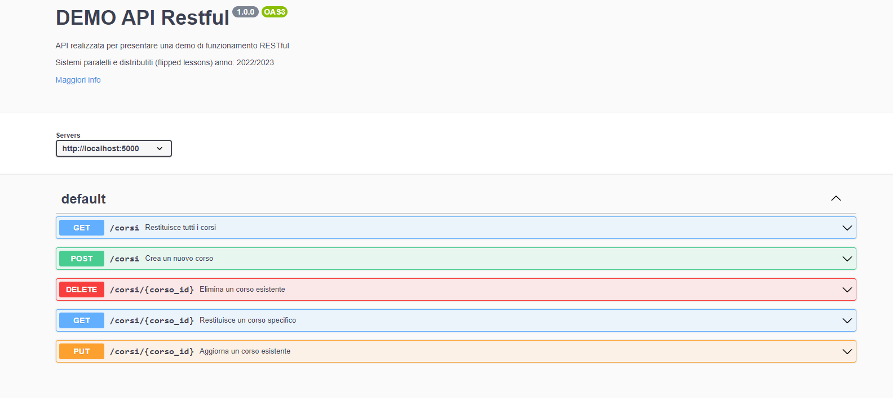
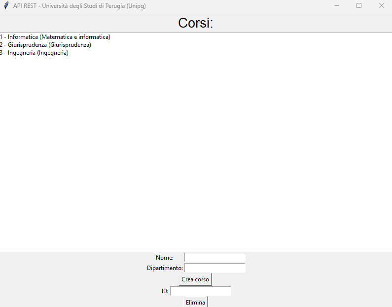

# DEMO API REST - Università degli Studi di Perugia (Unipg)

## **Sistemi Paralleli e Distribuiti 2022/2023**

Questa demo è composta da:

- Server dell’API: server.py
- Documentazione interattiva: documentazione.js
- 3 Interfacce client per mostrare l’uso dell’API in un ambiente reale: /app (client swagger), client.py (client grafico), index.html (client web)

# Setup:
### Prerequisiti:
È necessario avere installati Node.js, Python e i relativi gestori dei pacchetti (npm, pip).

#### Linux:

1.  **Node.js**:
    
    *   Apri il terminale.
    *   Utilizza il gestore dei pacchetti della tua distribuzione Linux per installare Node.js. Ad esempio, su Ubuntu, puoi usare il comando `sudo apt install nodejs`.
2.  **Python**:
    
    *   Apri il terminale.
    *   Utilizza il gestore dei pacchetti della tua distribuzione Linux per installare Python. Ad esempio, su Ubuntu, puoi usare il comando `sudo apt install python3`.
3.  **Gestori dei pacchetti**:
    
    *   Per installare npm (gestore dei pacchetti per Node.js), puoi utilizzare il comando `sudo apt install npm`.
    *   Per installare pip (gestore dei pacchetti per Python), puoi utilizzare il comando `sudo apt install python3-pip`.

#### Windows:

1.  **Node.js**:
    
    *   Vai al sito web ufficiale di Node.js ([https://nodejs.org](https://nodejs.org)) utilizzando il tuo browser.
    *   Scarica il programma di installazione di Node.js per Windows.
    *   Esegui il programma di installazione e segui le istruzioni visualizzate sullo schermo per completare l'installazione di Node.js.
2.  **Python**:
    
    *   Vai al sito web ufficiale di Python ([https://www.python.org](https://www.python.org)) utilizzando il tuo browser.
    *   Scarica il programma di installazione di Python per Windows.
    *   Esegui il programma di installazione e assicurati di selezionare l'opzione "Aggiungi Python al percorso di sistema" durante l'installazione per rendere Python accessibile da qualsiasi posizione nel tuo sistema.
3.  **Gestori dei pacchetti**:
    
    *   npm (già incluso nell'installazione di Node.js) viene installato automaticamente durante l'installazione di Node.js su Windows.
    *   pip viene installato automaticamente insieme a Python durante l'installazione su Windows.

#### Mac:

1.  **Node.js**:
    
    *   Vai al sito web ufficiale di Node.js ([https://nodejs.org](https://nodejs.org)) utilizzando il tuo browser.
    *   Scarica il programma di installazione di Node.js per macOS.
    *   Esegui il programma di installazione e segui le istruzioni visualizzate sullo schermo per completare l'installazione di Node.js.
2.  **Python**:
    
    *   Vai al sito web ufficiale di Python ([https://www.python.org](https://www.python.org)) utilizzando il tuo browser.
    *   Scarica il programma di installazione di Python per macOS.
    *   Esegui il programma di installazione e segui le istruzioni visualizzate sullo schermo per completare l'installazione di Python.
3.  **Gestori dei pacchetti**:
    
    *   npm (già incluso nell'installazione di Node.js) viene installato automaticamente durante l'installazione di Node.js su macOS.
    *   pip viene installato automaticamente insieme a Python durante l'installazione su macOS.

Assicurati di verificare la documentazione ufficiale di Node.js e Python per ulteriori informazioni sulle versioni specifiche e le istruzioni di installazione più aggiornate.


### Dipendenze:

```bash
npm install express swagger-ui-express yamljs
pip install -r requirements.txt
```

## Server API RESTful:

```bash
python server.py
```

> Nota: all’avvio verrà fornito anche un link pubblico attraverso ngrok (utile per essere condiviso con chi non riesce ad effettuare questo passaggio).
> 

> Se stai utilizzando utilizzando il link che ti è stato condiviso aggiorna l’ultima riga del file **`definizione_openapi.yaml`**
> 

```bash
servers:
- url: {url_qui}
```

## Documentazione interattiva:

```bash
node documentazione.js
```

Apri questo link: [http://localhost:3000/](http://localhost:3000/) 

ti ritroverai davanti questa interfaccia: 



# Opzionale:

Se vuoi testare come le API Rest vengono utilizzate per esporre il modello dati a diverse interfacce

### Client swagger
```bash
python /app/app.py
```
### Client grafico
```bash
python client.py
```


### Client web
file: index.html (doppio click)
